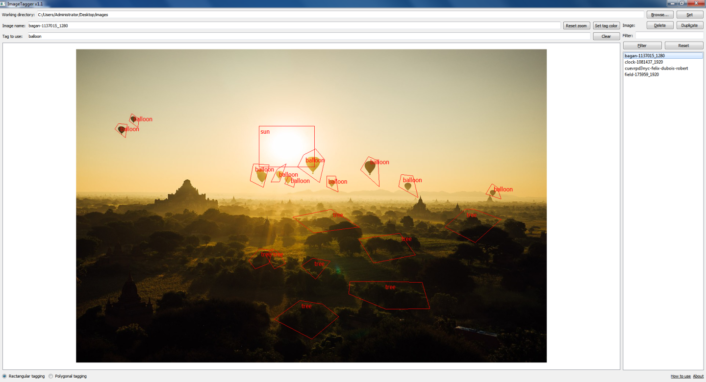

### How to use ImageTagger

ImageTagger supports rectangular and also much more precise polygonal tagging. Before tagging a region, first ensure you have entered a tag name.  
To create a rectangular tag, make sure the "Rectangular tagging" radio button is checked. Hover the cursor above the starting point in the image, then right-click and drag the cursor to the end point. Release the right mouse button.  
Should you want to create a polygonal tag, check the "Polygonal tagging" radio button, then use the right mouse button to begin a polygon. 
Specify the edges of the polygon using by clicking with the right mouse button, then click anywhere in the image with the left mouse button to close the polygon.  
To delete a tag, left-click on it, then press __[Del]__ on your keyboard.

### Download

Download link: [Win32 binary](https://github.com/Extender/ImageTagger/raw/master/bin/imagetagger-v1.1-bin-win32.zip)

### Screenshot

#### Further information

ImageTagger is a useful tool for tagging regions of images, for example in order to create training sets for deep learning. 
It produces __.taglist.json__ files, which contain the tag names as well as the coordinates of the image's tags.
A __.taglist.json__ file looks like this:

<pre>
{
    "note": "This file is auto-generated. Modifying its structure will cause the image tagger to stop working.",
    "fileFormatVersion": 1.1,
    "minFileFormatVersion": 1.1,
    "tagCount": 4,
    "tags":
    [
        ["tagName1", "rect", tag1LeftX, tag1TopY, tag1RightX, tag1BottomY],
        ["tagName2", "rect", 60, 534, 459, 385],
        ["tagName3", "polygon", [tag3Point1X, tag3Point1Y], [tag3Point2X, tag3Point2Y], [tag3Point3X, tag3Point3Y], ...],
        ["tagName4", "polygon", [235, 403], [259, 455], [322, 487], [289, 290]],
        ...
    ]
}
</pre>

The files are stored in the same directory as the input images, and will have the same name, with __".taglist.json"__ appended to it.
For example, "image.jpg" yields "image.jpg.taglist.json".

To begin tagging, simply set a working directory, which should contain the images you want to tag.
